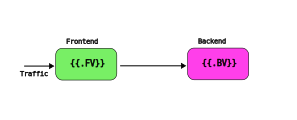

# Using Argo Rollouts with many microservices

Example with Argo Rollouts with backend and frontend

Read the full blog post at https://codefresh.io/blog/multi-service-progressive-delivery-with-argo-rollouts/ 



## Run only the backend manually

Install [GoLang](https://go.dev/) locally

```
cd src/interest
APP_VERSION=1.2  go run .
```
You can now acces the backend at `http://localhost:8080`

## Run only the frontend manually

Install [GoLang](https://go.dev/) locally

```
cd src/loan
APP_VERSION=1.4 PORT=9000 BACKEND_HOST=localhost go run .
```

You can now access the backend at `http://localhost:9000`

## Run both of them at the same time

Install [Docker compose](https://docs.docker.com/compose/) (no need for local GoLang installation)

```
cd src
docker compose up
```

And now you can use the same URLs as above to access the services.

## Run on Kubernetes as deployments

```
cd manifests/plain
kubectl create ns plain
kubectl apply -f . -n plain
kubectl port-forward svc/my-plain-backend-service 8000:8080 -n plain
kubectl port-forward svc/my-plain-frontend-service 9000:8080 -n plain
```

You can now access the backend at `http://localhost:8000` and the backend at `http://localhost:9000`

## Run on Kubernetes as Rollouts (modern app)

```
cd manifests/modern
kubectl create ns modern
kubectl apply -f . -n modern
kubectl port-forward svc/backend-active 8000:8080 -n modern
kubectl port-forward svc/backend-preview 8050:8080 -n modern

kubectl port-forward svc/frontend-active 9000:8080 -n modern
kubectl port-forward svc/frontend-preview 9050:8080 -n modern
```

You can now access the backend at `http://localhost:8000` (old) and `http://localhost:8050` (new)
and the backend at `http://localhost:9000` (old) and `http://localhost:9050` (new)

To see what the rollouts are doing

```
kubectl-argo-rollouts get rollout my-frontend -n modern
kubectl-argo-rollouts get rollout my-backend -n modern
```

## Run on Kubernetes as Rollouts (legacy app)

```
cd manifests/legacy
kubectl create ns legacy
kubectl apply -f manifests/legacy/rollout-be.yml -n legacy
kubectl apply -k manifests/legacy/. -n legacy
kubectl port-forward svc/backend-active 8000:8080 -n legacy
kubectl port-forward svc/backend-preview 8050:8080 -n legacy

kubectl port-forward svc/frontend-active 9000:8080 -n legacy
kubectl port-forward svc/frontend-preview 9050:8080 -n legacy
```

You can now access the backend at `http://localhost:8000` (old) and `http://localhost:8050` (new)
and the backend at `http://localhost:9000` (old) and `http://localhost:9050` (new)

To see what the rollouts are doing

```
kubectl-argo-rollouts get rollout my-frontend -n legacy
kubectl-argo-rollouts get rollout my-backend -n legacy
```
